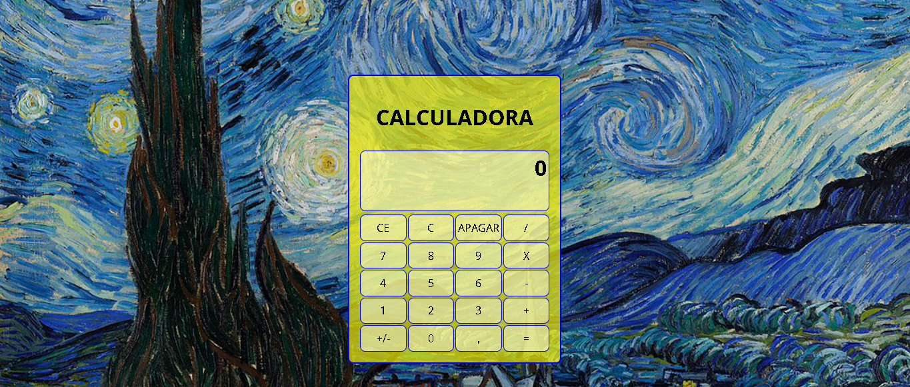

# Calculadora Simples

## Descrição do Projeto

Uma calculadora simples desenvolvida com HTML, CSS e JavaScript. A calculadora permite realizar operações matemáticas básicas, como adição, subtração, multiplicação e divisão, além de suportar números positivos e negativos.

## Funcionalidades

- Realizar cálculos matemáticos básicos.
- Inserir números no visor.
- Limpar a tela de visor.
- Inverter o sinal do número exibido.
- Realizar operações de adição, subtração, multiplicação, divisão e potenciação.
- Tratar erros e exibir mensagens apropriadas.

## Demonstração

Para ver a calculadora em ação, você pode acessar o [link da demonstração](https://leonardos1lva.github.io/calculadora-simples).

## Autor

[Leonardo Silva](https://github.com/LeonardoS1lva)

